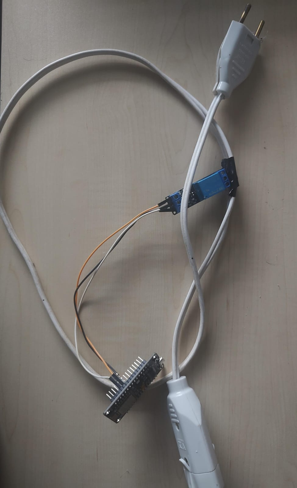

# Projeto II - INTEGRANDO ALEXA COM NODEMCU826

## Descrição do Projeto

Este projeto tem como objetivo demonstrar como controlar um dispositivo (como um relé) por meio de um ESP8266 utilizando a plataforma SinricPro e uma conexão Wi-Fi. O dispositivo pode ser controlado remotamente via SinricPro ou por meio de um botão físico conectado ao ESP8266.

Seguindo o circuito a seguir:


Esquema físico:


## Pré-requisitos

Antes de iniciar o projeto, certifique-se de ter os seguintes pré-requisitos:

- Hardware:
  - ESP8266 (NodeMCU ou similar)
  - Relé (ou outro dispositivo que deseja controlar)
  - Botão (ou outro dispositivo de entrada)
- Acesso à Internet para configuração da plataforma SinricPro

- Software:
  - VSC instalado e configurado com o platform.io
  - Bibliotecas necessárias:
    - ESP8266WiFi
    - SinricPro
    - SinricProSwitch

## Configuração

Antes de usar o código, é necessário fazer algumas configurações:

- Defina as constantes de conexão Wi-Fi, APP_KEY, APP_SECRET e SWITCH_ID:

  ```cpp
  #define WIFI_SSID "sua_rede_wifi"
  #define WIFI_PASS "sua_senha_wifi"
  #define APP_KEY "sua_app_key_sinricpro"
  #define APP_SECRET "seu_app_secret_sinricpro"
  #define SWITCH_ID "seu_id_do_dispositivo"
    ```

Certifique-se de substituir os valores acima pelos dados da sua rede Wi-Fi e da sua conta SinricPro.

- Conecte o relé e o botão ao ESP8266, e ajuste as definições de pinos GPIO, se necessário:

 ```cpp
    #define BUTTON_PIN 0
    #define RELE_PIN 5
 ```

## Funcionamento

O código consiste em duas funções principais:

- onPowerState: Esta função é chamada quando o dispositivo é controlado remotamente via SinricPro. Ela atualiza o estado do dispositivo e controla o relé com base no estado.

- handleButtonPress: Esta função trata a pressão do botão físico e atualiza o estado do dispositivo. Ela também envia o novo estado para o servidor SinricPro.

O código se encarrega de conectar o ESP8266 à rede Wi-Fi e à plataforma SinricPro, e o loop principal verifica constantemente e trata as solicitações da plataforma SinricPro.

## Uso

Para controlar o dispositivo remotamente, basta usar a plataforma SinricPro e associar o dispositivo a sua conta. Você pode então usar a plataforma para ligar e desligar o dispositivo.

Também é possível controlar o dispositivo diretamente pressionando o botão físico conectado ao ESP8266.

## Autores

Este código foi criado por: Ana Julia G. Peres, Anna Clara, Natali Santos, Arthur Lunkes.

## Conclusão

Este projeto demonstra como controlar um dispositivo por meio da plataforma SinricPro e uma conexão Wi-Fi. Você pode adaptar este código para controlar outros dispositivos e adicionar mais funcionalidades conforme necessário.
